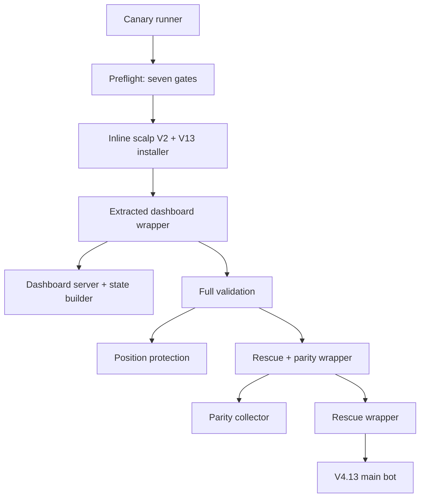

# Isolated dashboard canary data-path audit — 2026-09-20

Repository: `yz272n2tpf-lab/Btc-15min-bot`

Work branch only: `brti-websocket-dashboard-canary-20260919`

Audited base: `9becda3e01c3d5f7a1171379a5d89e0f74a4229f`

## Result and deployment boundary

The offline path-isolation checks pass. The candidate is suitable for a controlled **isolated dashboard canary** redeploy after publication. This is not a claim that a new live run has succeeded or that every unrelated runtime failure is ruled out.

No merge, deployment, production edit, order placement, live bot launch, credential retrieval, or live gateway qualification was performed. Railway's read-only service configuration identifies the canary's source as this branch and its start command as `python -u btc15_dashboard_ws_canary_runner_v1.py`. It does not establish that source pushes cannot auto-deploy. The tested commit is therefore held locally; the remote branch has not been advanced. Do not redeploy the old remote head expecting these fixes.

## Actual runtime chain

Exact entry and children: `btc15_dashboard_ws_canary_runner_v1.py` runs `btc15_dashboard_ws_canary_preflight_v1.py`, then execs `BTC15_DASHBOARD_INLINE_SCALP_DIAG_V2.py`. The latter imports `BTC15_DASHBOARD_INLINE_SCALP_V1.py` and `BTC15_DASHBOARD_RENDER_FIX_V1.py`, installs the payload through `BTC15_INSTALL_LIVE_DASHBOARD_V13.py`, then execs embedded `BTC15_RUN_FULL_VALIDATION_WITH_DASHBOARD_V1.py`.

The wrapper starts embedded `BTC15_DASHBOARD_LIVE_SERVER_V1.py` (which imports embedded `BTC15_DASHBOARD_STATE_V2.py`) and `btc15_run_full_validation_v1.py`. Full validation starts `btc15_final_position_protection_shadow_v3.py` and `btc15_run_with_rescue_v2_and_parity_v1.py`; that meta-wrapper starts `btc15_kalshi_parity_shadow_v1.py` and `btc15_run_with_rescue_v2_shadow_v1.py`; rescue starts `bot_two_output_build_v4_13_profit_protection_shadow.py`.

Preflight, bot and parity use `btc15_brti_shared_consumer_v1.py` / `btc15_brti_ws_gateway_client_v1.py`. The bot, parity, rescue, protection and dashboard now use `btc15_data_paths_v1.py`, copied beside the extracted dashboard by the installer.

The gate follows local imports and Python child references and explicitly decodes installer payloads. It audits 18 runtime Python sources. Existing unrelated research scripts, historical backups and repair utilities are not launched by this tree.

## Every problematic runtime path found

All paths below were capable of bypassing isolation through a literal `/data` filename or a separate `/data`-or-working-directory root. With `BTC15_ISOLATED_CANARY_LOCAL_DATA=1`, their effective root is now `/tmp/btc15-canary-data`, even if `/data` exists or `BTC15_DATA_DIR=/data` is inherited.

| Original production path | Affected use | Correction |
| --- | --- | --- |
| `/data/kalshi_15m_ladder_state.json` | Main-bot ladder state read/write | `_btc15_data_path(...)` |
| `/data/kalshi_early_conf_shadow_v1_2.csv` | Main-bot EARLY shadow initialization/append; confirmed crash | `_btc15_data_path(...)` |
| `/data/kalshi_true_scalp_forward_shadow_v1.csv` | Main-bot true-scalp initialization/append | `_btc15_data_path(...)` |
| `/data/kalshi_profit_protection_forward_shadow_v1.csv` | Main-bot profit-protection initialization/append | `_btc15_data_path(...)` |
| `/data/kalshi_subminute_unified_v1_1.csv` | Rescue, protection and dashboard input; producer/parity were already isolated | All readers now use shared root |
| `/data/kalshi_rescue_v2_shadow_v1.csv` | Rescue output and dashboard input | Shared root |
| `/data/kalshi_rescue_v2_shadow_state_v1.json` | Rescue state read/write | Shared root |
| `/data/kalshi_rescue_v2_shadow_state_v1.tmp` | Rescue atomic state staging | Remains sibling of isolated JSON |
| `/data/kalshi_final_position_protection_shadow_v3.csv` | Protection output and dashboard input | Shared root |
| `/data/kalshi_final_position_protection_shadow_v3_state.json` | Protection state read/write | Shared root |
| `/data/kalshi_final_position_protection_shadow_v3_state.tmp` | Protection atomic state staging | Remains sibling of isolated JSON |
| `/data/kalshi_two_output_live_log_v4_13.csv` | Dashboard input; main-bot writer was already isolated | Dashboard now shares writer's root |
| `/data/kalshi_app_parity_shadow_v1.csv` | Dashboard input; parity writer was already isolated | Dashboard now shares writer's root |
| `/data/dashboard_state.json` | State builder's optional CLI output (server builds JSON in memory) | Shared root |

The dashboard's optional `--pull` diagnostic also downloads five production CSVs via `/data/{filename}`: unified, live, rescue, app-parity and final-position-protection, as listed above. It is not invoked by the live server. It now rejects canary mode before running the Railway CLI, preventing this alternate path from mixing production evidence into an isolated run.

Already-correct main-bot paths remain isolated: live snapshot, scalp snapshots/events/state, direct-BRTI parity and unified subminute data. The direct-BRTI parity process still uses the qualified WebSocket transport. Moving its root selection into the shared helper changes no transport behavior.

## Every changed file and exact scope

| File | Change |
| --- | --- |
| `btc15_data_paths_v1.py` (new) | Shared `_btc15_isolated_canary`, `_btc15_data_root`, `_btc15_data_path`; canary root precedence, directory creation, basename escape rejection; preserves legacy off-canary root behavior. |
| `bot_two_output_build_v4_13_profit_protection_shadow.py` | Import shared path helper instead of defining a private copy; convert only ladder, EARLY, true-scalp and profit-protection path bindings. |
| `btc15_run_with_rescue_v2_shadow_v1.py` | Shared root with existing off-canary fallback retained; update one root-related docstring sentence. |
| `btc15_final_position_protection_shadow_v3.py` | Shared root with existing off-canary fallback retained. |
| `btc15_kalshi_parity_shadow_v1.py` | Replace duplicated root selection with shared helper; all existing parity filenames and WebSocket logic unchanged. |
| `BTC15_INSTALL_LIVE_DASHBOARD_V13.py` | Update embedded state builder to use helper and reject canary `--pull`; copy helper into extracted directory; correct embedded wrapper's inaccurate persistent-volume self-test message/docstring. |
| `test_btc15_canary_data_path_static.py` | Replace two-filename marker check with complete runtime traversal, decoded-payload audit, explicit path bindings, rejection of unreviewed `/data`/CSV/JSON/temp paths, helper-packaging check, preflight-inclusion check and mocked root-selection matrix. |
| `test_btc15_canary_data_path_regressions.py` (new) | Eleven offline regression tests, including path-leak mutations, a newly introduced child, missing helper, guarded remote pull, all reader/writer bindings and actual CSV initialization/append on temporary test files. |
| `CANARY_DATA_PATH_AUDIT_20260920.md` (new) | This audit, path inventory, retained-reference rationale, validation results and deployment boundary. |

Embedded Python modified inside the installer: `BTC15_DASHBOARD_STATE_V2.py` and `BTC15_RUN_FULL_VALIDATION_WITH_DASHBOARD_V1.py`. They are payloads, not separate repository files.

## Production and behavior preservation

- Isolation flag `1` (whitespace stripped): all runtime data readers/writers use `/tmp/btc15-canary-data`; directories are created before logging. No fallback to production data.
- Main bot/parity off-canary: preserve `BTC15_DATA_DIR` with `/data` as default.
- Rescue/protection/dashboard off-canary: preserve their prior behavior, `/data` if present, otherwise working directory. They still do not adopt `BTC15_DATA_DIR` in this legacy mode. Unifying that separate production behavior would exceed this task.
- AST comparison against the audited base passed after normalizing only the reviewed path declarations/imports/helper and the new dashboard pull guard. The remaining main-bot, parity, rescue, protection and dashboard-state logic is identical.
- No strategy, model, probability, threshold, timestamp, target, contract selection, scheduling, ±$11 WAIT, FINAL-60, EARLY/scalp, WebSocket or order behavior changed.
- Packaged HTML, dashboard server and README payloads are byte-identical. Fully patched V13/V8.1 rendered HTML is byte-identical to baseline; SHA-256: `69805f53dff7a4c492ecf3b0d8e169df267bc232b077ca9a0ca76bfc3719ef65`.

## Test results

All seven existing requested gates passed:

1. `test_btc15_dashboard_ws_canary_static.py`
2. `test_btc15_dashboard_ws_runner_static.py`
3. `test_btc15_dashboard_parity_ws_static.py`
4. `test_btc15_brti_ws_gateway_client_v1_static.py`
5. `test_btc15_brti_ws_adapter_compat_static.py`
6. `test_brti_main_cutover_static_gate_v1.py`
7. `test_btc15_canary_data_path_static.py`

Also passed:

- `test_btc15_canary_data_path_regressions.py`: 11 tests (multiple path/root mutation subcases).
- Isolated-mode `--self-test` for inline scalp diagnostic V2, full-validation runner, rescue/parity meta-wrapper and rescue wrapper. Inline self-test also executes the extracted dashboard wrapper/server self-tests.
- Syntax compilation of all eight changed/new repository Python files and all three embedded Python payloads.
- Shared-root matrix: flag `1`, padded `1`, `0` and unset; production mount present/absent; custom data-dir override present/absent; legacy fallback on/off; invalid/escaping filenames.
- Every audited runtime path declaration resolves to its expected canary basename, including atomic state temp siblings.
- Actual main-bot CSV header creation and append functions exercised against all eight bot CSV filenames in temporary storage.
- Extracted shared helper is byte-identical to repository helper.
- Final runtime-chain scan: only the explicitly retained production defaults and guarded diagnostic references listed below remain.
- `git diff --check`: pass.

The full live preflight was intentionally not run: it contacts the qualified gateway. No live bot, market API, order API, gateway freshness requalification or deployment was run for this offline audit. Static gates are not a substitute for checking fresh PRIMARY_OK, correct contract/target alignment and all children remaining alive after the next authorized canary redeploy.

## Every remaining `/data` reference and why retained

### Active runtime

| Location | Reference | Why retained |
| --- | --- | --- |
| `btc15_data_paths_v1.py`, `_btc15_data_root` | `Path('/data')` plus `.exists()` (two literals) | Existing off-canary rescue/protection/dashboard mounted-volume behavior. Canary branch is selected first. |
| Same helper | `os.getenv('BTC15_DATA_DIR', '/data')` | Existing off-canary main/parity production default. Canary branch is selected first. |
| Embedded dashboard state, `pull_local_files` | `f'/data/{filename}'` | Explicit off-canary, read-only Railway download diagnostic. New first-statement guard rejects isolated mode before subprocess execution. |
| Embedded dashboard state, `main` | `DATA_ROOT != Path('/data')` | Existing optional CLI `--pull` condition; not a file write. Pull is now blocked in canary mode. |
| Embedded state/server docstrings | Descriptions of production `/data` inputs | Documentation of retained production behavior, not executed paths. |
| Packaged dashboard README | Production `/data` input description | Read-only packaged documentation, never executed by this runner; does not select a canary data root. |

No unguarded executable production `/data` read/write remains in the audited isolated canary chain.

### Repository files outside the runtime chain (unchanged)

| File | Remaining references and reason |
| --- | --- |
| `bot_two_output_build_v4_13_profit_protection_shadow_pre_persist_backup.py` | Historical scalp snapshots/events/state, direct-BRTI, EARLY, unified, true-scalp and profit-protection paths. Backup not imported/launched by this runtime. |
| `bot_two_output_build_v4_13_profit_protection_shadow_persist_candidate.py` | Same historical paths plus ladder state and live snapshot. Old candidate not imported/launched. |
| `btc15_make_persistence_candidate_v1.py` | Production ladder/live-log paths in rewrite specifications, verification and documentation. Manual historical migration utility. |
| `btc15_make_persistence_candidate_v2.py` | Production ladder/live-log rewrite targets. Manual historical migration utility. |
| `btc15_promote_verified_persistence_v1.py` | Production ladder/live-log verification/promotion strings. Manual utility; not run. |
| `btc15_verify_persistence_candidate_v1.py` | Expected production ladder/live-log strings. Historical candidate verifier, not an active canary safety gate. |
| `btc15_railway_persistence_audit_v1.py` | `/data` production-persistence classification/defaults and diagnostic messages. Read-only audit utility, not run by canary. |
| `btc15_three_path_dependency_audit_v1.py` | Production-persistence explanatory text only. |
| `scalp_lead_shadow_v6.py` | The substring `price-zone/data-quality` in a startup message is a search false positive, not an absolute data path. |
| `test_btc15_canary_data_path_static.py`, `test_btc15_canary_data_path_regressions.py` | Approved production defaults, test expectations and intentionally bad path fixtures for leak rejection; no live bot writes. |
| `docs/BRTI_WEBSOCKET_DASHBOARD_DEPLOY_RUNBOOK_20260919.md` | Existing instruction not to copy production `/data` into the canary; retained and followed. |
| `docs/BRTI_WEBSOCKET_DASHBOARD_CANARY_SCORECARD_20260919.md` | `logs/data` in the isolation checklist is a search false positive, not an absolute path. |
| This audit document | Explicit path inventory and rationale, not executable. |

These historical utilities should not be run as part of this canary repair. Their old replacement assumptions were deliberately not broadened or repurposed.

### Other paths intentionally retained

- `brti_calibration_results.csv` and `btc_35d_live_cache.csv`: packaged/read-only calibration and historical price inputs. Relocating them could alter model availability or behavior.
- `~/.kalshi/key_id`, `~/.kalshi/private_key.pem`: existing read-only credential fallback locations. No values were read or printed during this work.
- `/tmp/btc15_dashboard_v13`: extracted program/HTML asset directory, not runtime market data. The installer copies the shared helper here for child import resolution; HTML patching stays here.
- Repository/cwd Python paths: actual child programs and read-only self-test source checks, not bot evidence files.
- `/dashboard_state.json`: dashboard HTTP route, not an absolute disk path.
- Existing V8.1 diagnostic feed URL and WebSocket gateway transport: external read-only inputs, unchanged. Data-path isolation is not complete upstream-service isolation.

No ambiguous input asset, credential location, historical tool or upstream feed was relocated.
